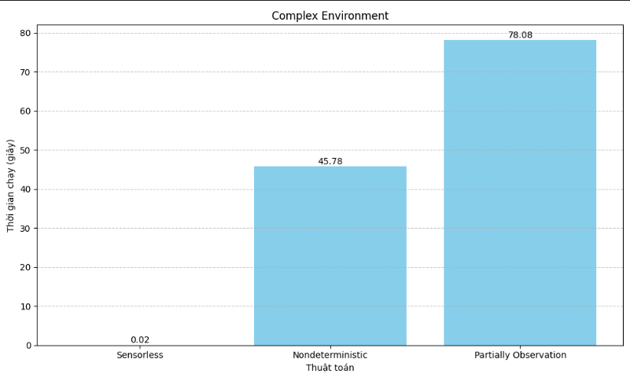
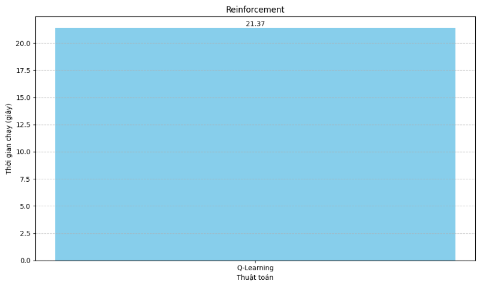

# 🧠 Chinh Phục Màn Sương: Khám Phá Các Thuật Toán Tìm Kiếm Trong Bài Toán 8-Puzzle

## ✨ Tổng Quan Dự Án

Dự án cá nhân này tập trung vào việc hiện thực hóa và khám phá các thuật toán tìm kiếm, một nền tảng quan trọng của Trí tuệ Nhân tạo (AI). Điểm đặc biệt của dự án là mở rộng phạm vi nghiên cứu ra ngoài các môi trường quan sát đầy đủ truyền thống, để giải quyết những thách thức phức tạp của các kịch bản **phi cảm biến, phi tất định và quan sát một phần**. Dự án này đi sâu vào sức mạnh và khả năng thích ứng của các chiến lược tìm kiếm khác nhau khi đối mặt với sự không chắc chắn về trạng thái của tác nhân và hậu quả của các hành động.

## 🧭 Các Thuật Toán Đã Triển Khai

Dự án này triển khai một loạt các thuật toán tìm kiếm đa dạng, được phân loại như sau:

### 1. 🔍 Nhóm Thuật Toán Tìm Kiếm Không Thông Tin 

Các thuật toán này hoạt động mà không có bất kỳ kiến thức tiên验 nào về trạng thái mục tiêu, chỉ dựa vào thông tin được định nghĩa trong bài toán.

* **Tìm kiếm theo chiều rộng (BFS):** Mở rộng không gian tìm kiếm theo từng cấp độ.
* **Tìm kiếm theo chiều sâu (DFS):** Mở rộng sâu nhất có thể dọc theo mỗi nhánh trước khi quay lui.
* **Tìm kiếm chi phí đồng nhất (UCS):** Mở rộng nút có chi phí đường đi thấp nhất.
* **Tìm kiếm sâu dần lặp lại (IDS):** Kết hợp ưu điểm về hiệu quả không gian của DFS và tính đầy đủ của BFS.

### 2. 💡 Nhóm Thuật Toán Tìm Kiếm Có Thông Tin (Tìm Kiếm Heuristic)

Các thuật toán này sử dụng các hàm heuristic để ước tính chi phí đến mục tiêu, hướng dẫn quá trình tìm kiếm hiệu quả hơn.

* **Tìm kiếm tham lam theo ưu tiên tốt nhất:** Mở rộng nút được ước tính là gần mục tiêu nhất.
* **Tìm kiếm A*:** Kết hợp chi phí đã đi đến nút và chi phí ước tính đến mục tiêu, đảm bảo tính tối ưu trong các điều kiện nhất định.
* **IDA* (A* sâu dần lặp lại):** Một phiên bản sâu dần lặp lại của A*, hữu ích cho các không gian tìm kiếm lớn.

### 3. 🗺️ Nhóm Thuật Toán Tìm Kiếm Cục Bộ

Các thuật toán này hoạt động bằng cách cải thiện lặp đi lặp lại một giải pháp ứng viên duy nhất cho đến khi tìm thấy một giải pháp thỏa đáng.

* **Leo đồi đơn giản:** Di chuyển đến hàng xóm có giá trị hàm đánh giá tốt nhất.
* **Leo đồi ngẫu nhiên:** Giới thiệu tính ngẫu nhiên trong việc chọn hàng xóm tiếp theo.
* **Leo đồi dốc nhất:** Đánh giá tất cả các hàng xóm và di chuyển đến hàng xóm tốt nhất.
* **Tôi luyện mô phỏng (Simulated Annealing):** Cho phép di chuyển đến các trạng thái tồi tệ hơn với một xác suất giảm dần theo thời gian, giúp thoát khỏi các cực tiểu cục bộ.
* **Thuật toán di truyền (Genetic Algorithm):** Một thuật toán metaheuristic dựa trên quần thể, lấy cảm hứng từ chọn lọc tự nhiên.
* **Tìm kiếm theo chùm tia cục bộ (Local Beam Search):** Duy trì và cải thiện nhiều giải pháp ứng viên.

### 4. 🧩 Nhóm Thuật Toán Bài Toán Thỏa Mãn Ràng Buộc (CSPs)

Các thuật toán này tập trung vào việc tìm kiếm các phép gán giá trị cho các biến sao cho thỏa mãn một tập hợp các ràng buộc.

* **Quay lui (Backtracking):** Một thuật toán tổng quát để tìm tất cả (hoặc một số) giải pháp cho một số bài toán tính toán, xây dựng dần các ứng viên cho giải pháp và từ bỏ một ứng viên ("quay lui") ngay khi xác định rằng ứng viên này không thể hoàn thành thành một giải pháp hợp lệ.
* **Quay lui tiến (Backtracking Forward):** Một biến thể của quay lui kết hợp kiểm tra phía trước để cắt tỉa không gian tìm kiếm sớm hơn.
* **Giải quyết ràng buộc tối thiểu (Min-Conflicts):** Một thuật toán tìm kiếm cục bộ được thiết kế đặc biệt cho các bài toán thỏa mãn ràng buộc.

### 5. 🏞️ Điều Hướng Môi Trường Phức Tạp

Phần này có thể khám phá cách các thuật toán đã triển khai có thể được điều chỉnh hoặc mở rộng để xử lý những thách thức do môi trường phi cảm biến, phi tất định và quan sát một phần đặt ra.

### 6. 🤖 Nhóm Thuật Toán Học Tăng Cường (Reinforcement Learning)

Mặc dù không được đề cập rõ ràng trong danh sách ban đầu của bạn, việc bao gồm Học Tăng Cường cho thấy sự khám phá về cách các tác nhân có thể học được hành vi tối ưu thông qua tương tác với môi trường, đặc biệt phù hợp trong các thiết lập không chắc chắn.

## 🎯 Giải Quyết Sự Bất Định

Trọng tâm của dự án này nằm ở việc giải quyết những phức tạp do:

* **Môi trường phi cảm biến:** Tác nhân không có thông tin trực tiếp về trạng thái hiện tại của nó.
* **Môi trường phi tất định:** Các hành động có thể có những kết quả không thể đoán trước.
* **Môi trường quan sát một phần:** Tác nhân chỉ có thông tin hạn chế và có khả năng nhiễu về trạng thái của môi trường.

Các triển khai trong dự án này có khả năng chứng minh cách các thuật toán tìm kiếm khác nhau có thể được điều chỉnh hoặc cách các phương pháp tiếp cận mới có thể được phát triển để lập kế hoạch và hành động hiệu quả trong các kịch bản đầy thách thức như vậy.

## 🚀 Các Hướng Phát Triển Tiềm Năng

Phát triển trong tương lai có thể bao gồm:

* Phân tích và so sánh chi tiết hiệu suất của các thuật toán trong các môi trường bất định khác nhau.
* Triển khai các kỹ thuật tiên tiến hơn để xử lý sự không chắc chắn, chẳng hạn như theo dõi trạng thái niềm tin hoặc lập kế hoạch xác suất.
* Trực quan hóa quá trình tìm kiếm trong các môi trường phức tạp này.
* Ứng dụng các thuật toán này vào các bài toán thực tế cụ thể liên quan đến sự không chắc chắn.
