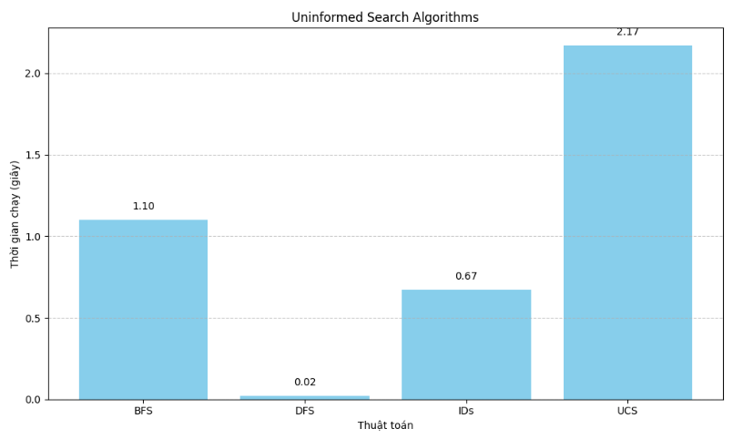
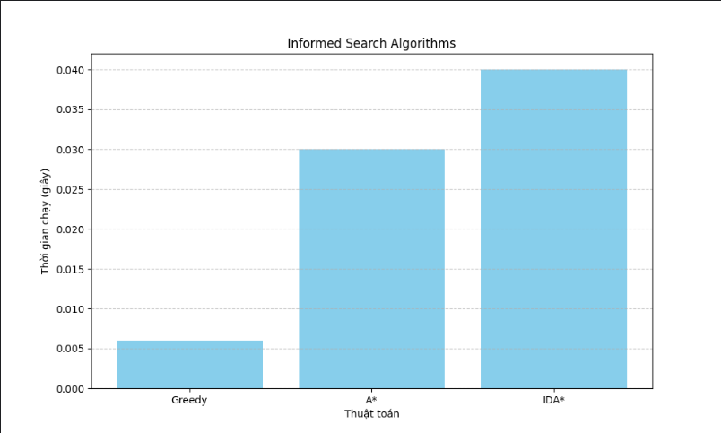
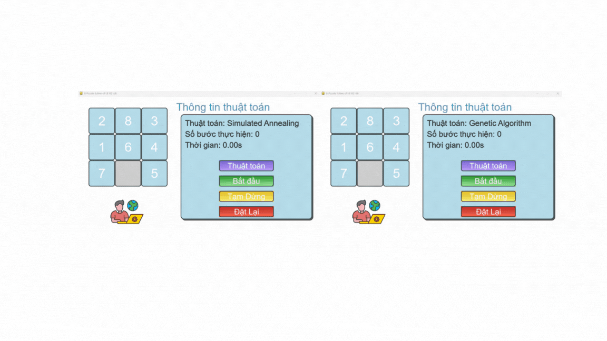
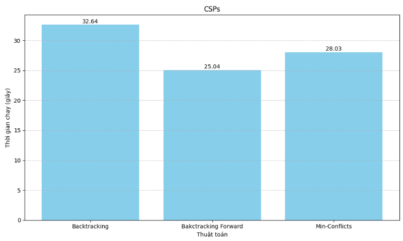
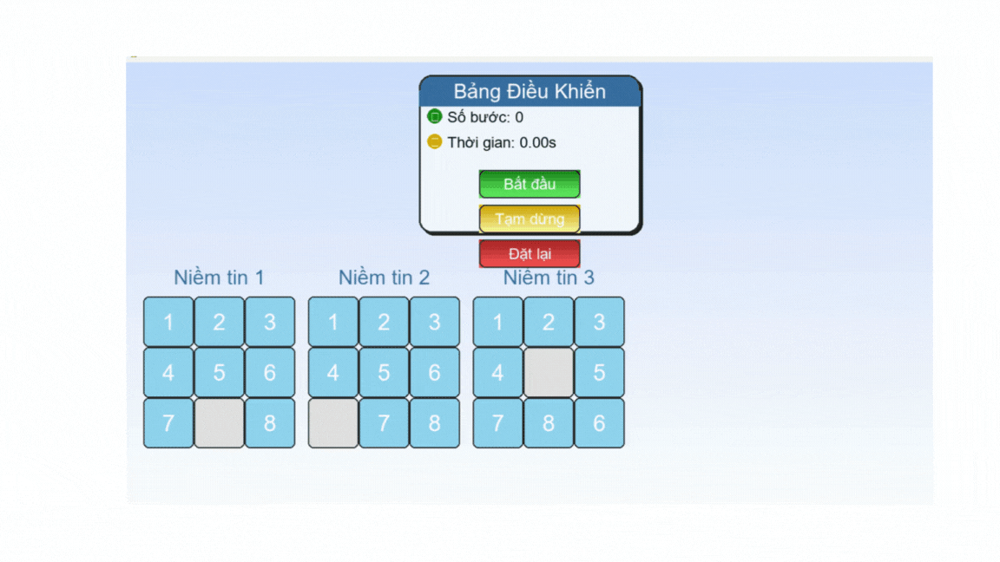
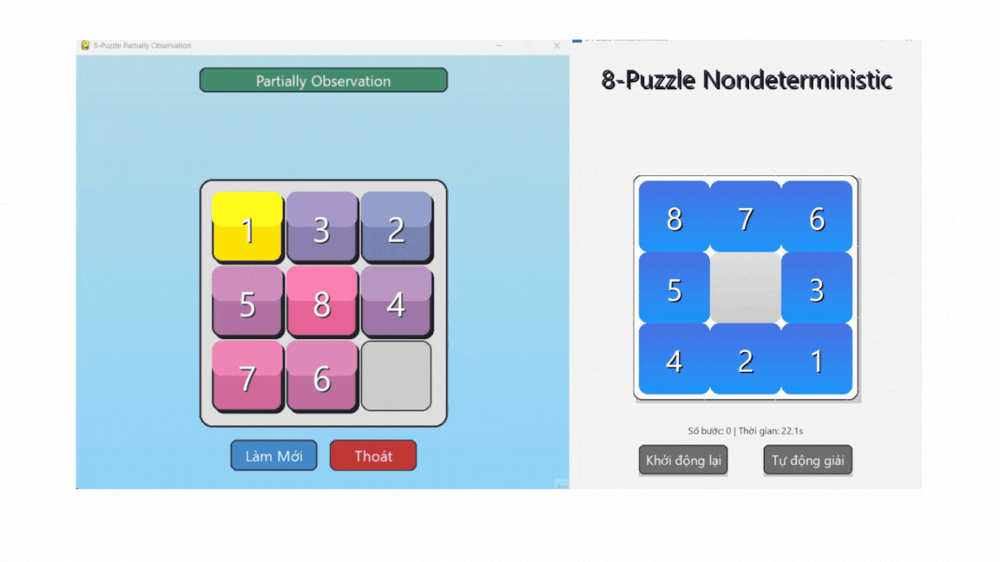

# 🧠 Chinh Phục Màn Sương: Khám Phá Các Thuật Toán Tìm Kiếm Trong Bài Toán 8-Puzzle

## ✨ Tổng Quan Dự Án

Dự án cá nhân này tập trung vào việc hiện thực hóa và khám phá các thuật toán tìm kiếm, một nền tảng quan trọng của Trí tuệ Nhân tạo (AI). Điểm đặc biệt của dự án là mở rộng phạm vi nghiên cứu ra ngoài các môi trường quan sát đầy đủ truyền thống, để giải quyết những thách thức phức tạp của các kịch bản **phi cảm biến, phi tất định và quan sát một phần**. Dự án này đi sâu vào sức mạnh và khả năng thích ứng của các chiến lược tìm kiếm khác nhau khi đối mặt với sự không chắc chắn về trạng thái của tác nhân và hậu quả của các hành động.

## 🧭 Các Thuật Toán Đã Triển Khai

Dự án này triển khai một loạt các thuật toán tìm kiếm đa dạng, được phân loại như sau:

### 1. 🔍 Nhóm Thuật Toán Tìm Kiếm Không Thông Tin 

Các thuật toán này hoạt động mà không có bất kỳ kiến thức tiên验 nào về trạng thái mục tiêu, chỉ dựa vào thông tin được định nghĩa trong bài toán.

* **BFS:** Mở rộng không gian tìm kiếm theo từng cấp độ, sẽ ưu tiên khám cùng mực trước nha.
* **DFS:** Mở rộng sâu nhất có thể dọc theo mỗi nhánh trước khi quay lui.
* **UCS:** Mở rộng nút có chi phí đường đi thấp nhất dựa nền tảng BFS.
* **IDs:** Thuật toán kết hợp. Kết hợp ưu điểm về hiệu quả không gian của DFS và tính đầy đủ của BFS.

### 2. 💡 Nhóm Thuật Toán Tìm Kiếm Có Thông Tin (Tìm Kiếm Heuristic)

Các thuật toán này sử dụng các hàm heuristic để ước tính chi phí đến mục tiêu, hướng dẫn quá trình tìm kiếm hiệu quả hơn.

* **Greedy:** Mở rộng nút được ước tính là gần mục tiêu nhất là hàm h(N).
* **A*:** Kết hợp chi phí đã đi đến nút và chi phí ước tính đến mục tiêu, đảm bảo tính tối ưu trong các điều kiện nhất định, dựa hàm f(N)=g(N)+h(N).
* **IDA*:** Một phiên bản sâu dần lặp lại của A*, hữu ích cho các không gian tìm kiếm lớn với i=2*a.

### 3. 🗺️ Nhóm Thuật Toán Tìm Kiếm Cục Bộ

Các thuật toán này hoạt động bằng cách cải thiện lặp đi lặp lại một giải pháp ứng viên duy nhất cho đến khi tìm thấy một giải pháp thỏa đáng.

* **Simple Hill Climbing:** Di chuyển đến hàng xóm có giá trị hàm đánh giá tốt nhất.
* **Stochastic Hill Climbing:** Giới thiệu tính ngẫu nhiên trong việc chọn hàng xóm tiếp theo.
* **Steepest Hill Climbing:** Đánh giá tất cả các hàng xóm và di chuyển đến hàng xóm tốt nhất.
* **Simulated Annealing:** Cho phép di chuyển đến các trạng thái tồi tệ hơn với một xác suất giảm dần theo thời gian, giúp thoát khỏi các cực tiểu cục bộ.
* **Genetic Algorithm:** Một thuật toán có fitness là đánh giá chất lượng quần thể dựa trên cá thể, lấy cảm hứng từ chọn lọc tự nhiên.
* **Beam Search:** Duy trì và cải thiện nhiều giải pháp ứng viên với k giải pháp tốt nhất.

### 4. 🧩 Nhóm Thuật Toán Bài Toán Thỏa Mãn Ràng Buộc (CSPs)

Các thuật toán này tập trung vào việc tìm kiếm các phép gán giá trị cho các biến sao cho thỏa mãn một tập hợp các ràng buộc.

* **Backtracking:** Một thuật toán tổng quát để tìm tất cả (hoặc một số) giải pháp cho một số bài toán tính toán, xây dựng dần các ứng viên cho giải pháp và từ bỏ một ứng viên ("quay lui") ngay khi xác định rằng ứng viên này không thể hoàn thành thành một giải pháp hợp lệ.
* **Backtracking Forward:** Một biến thể của quay lui kết hợp kiểm tra phía trước để cắt tỉa không gian tìm kiếm sớm hơn.
* **Min-Conflicts:** Một thuật toán tìm kiếm cục bộ được thiết kế đặc biệt cho các bài toán thỏa mãn ràng buộc.

### 5. 🏞️ Điều Hướng Môi Trường Phức Tạp

Phần này có thể khám phá cách các thuật toán đã triển khai có thể được điều chỉnh hoặc mở rộng để xử lý những thách thức do môi trường phi cảm biến, phi tất định và quan sát một phần đặt ra.

* **Sensorless:** Tìm kiếm bằng niềm tin ban đầu người lập trình do không quan sát được môi trường, đánh giá đưa hành động phù hợp. Nếu tất cả niềm tin thỏa thì đúng.
* **Nondeterministic:** Tìm kiếm không xác định, mỗi hành động có thể bình thường và bất bình thường( đứng yên).
* **Partially Observation:** Tìm kiếm khi biết 1 phần cụ thể là vị trí 1x1 và 3x3 lần lượt là 1 và 0. Tìm kiếm giải pháp phù hợp.

### 6. 🤖 Nhóm Thuật Toán Học Tăng Cường (Reinforcement Learning)

* **Q-Learning:** Bằng việc tập huấn nhiều lần, đưa ra kinh nghiệm đánh giá, dựa vào Q-value, reward... đánh giá thay đổi và sau đó tìm đường đi sau những lần tập huấn.

### CẢM ƠN MỌI NGƯỜI ĐỌC VÀ MONG NHẬN ĐÁNH GIÁ VỀ ĐỒ ÁN CÁ NHÂN